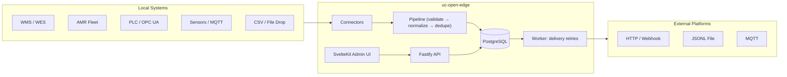

# UC Open Edge

**Open-source local edge integration framework**

UC Open Edge connects warehouse, robotics, manufacturing, automation, sensor, and operational systems to any business platform. It runs locally — on-premise or at the edge — and does not depend on or call any specific cloud service.

> **What it is:** A local adapter layer that captures operational events, normalizes them into a standard schema, stores them in PostgreSQL, deduplicates them, and forwards them to configurable destinations.
>
> **What it is not:** A robot controller, PLC controller, WMS, WES, SCADA system, or fleet manager. UC Open Edge integrates with those systems and normalizes local operational events for business platforms. It is not a cloud SaaS, an ERP, a message broker, or dependent on any vendor's APIs.

## Architecture



## Quick Start

### Prerequisites

- Node.js 22+
- Docker + Docker Compose
- pnpm (auto-enabled via `corepack enable pnpm`)

### 1. Clone and install

```bash
git clone https://github.com/your-org/uc-open-edge.git
cd uc-open-edge
corepack enable pnpm
pnpm install
```

### 2. Configure

```bash
cp .env.example .env
# Edit .env — set SESSION_SECRET, ADMIN_EMAIL, ADMIN_PASSWORD
```

### 3. Start Postgres

```bash
docker compose up -d postgres
```

### 4. Migrate and seed

```bash
pnpm db:migrate      # Apply migrations
pnpm db:seed         # Create admin user (requires ADMIN_EMAIL + ADMIN_PASSWORD in .env)
```

### 5. Start services (development)

```bash
# In separate terminals:
pnpm --filter @uc-open-edge/api dev      # API server → http://localhost:3001
pnpm --filter @uc-open-edge/worker dev   # Background worker
pnpm --filter @uc-open-edge/admin dev    # Admin UI → http://localhost:3000
```

### 6. Or use Docker Compose (all-in-one)

```bash
docker compose up
# Admin UI: http://localhost:3000
# API:      http://localhost:3001
```

### 7. Log in

Open http://localhost:3000, sign in with `ADMIN_EMAIL` / `ADMIN_PASSWORD`.

### 8. Send a test event

1. Create a **Source System** (e.g., name: `wms`, type: `wms`)
2. Create a **Connector** (type: `webhook`, name: `demo-webhook`)
3. Create an **API Key** (scope: `ingest`) — copy the key shown once
4. POST an event:

```bash
curl -X POST http://localhost:3001/api/ingest/webhook/demo-webhook \
  -H "Content-Type: application/json" \
  -H "X-API-Key: ucedge_XXXX_YYYY" \
  -d '{
    "eventType": "inventory.movement.reported",
    "externalEventId": "move-001",
    "occurredAt": "2026-07-05T12:00:00.000Z",
    "skuRef": { "externalSku": "ABC-123" },
    "fromLocationRef": { "externalLocationId": "BULK-A-17" },
    "toLocationRef":   { "externalLocationId": "PICKFACE-04-02-09" },
    "quantity": 6,
    "unitOfMeasure": "EA"
  }'
```

5. View the event in the Admin UI → Events

## Connector types

| Type                     | Description                                                   |
| ------------------------ | ------------------------------------------------------------- |
| `webhook`                | HTTP POST endpoint — `POST /api/ingest/webhook/:connectorKey` |
| `file_drop`              | Polls a folder for `.json` files                              |
| `csv`                    | Polls a folder for `.csv` files with column mappings          |
| `rest_poll`              | Polls an HTTP endpoint on an interval                         |
| `mqtt`                   | Subscribes to MQTT topics (real `mqtt` npm package)           |
| `opcua`                  | Config + interface only — stub (see docs/connector-opcua.md)  |
| `wms_template`           | Extend for your WMS API                                       |
| `wes_template`           | Extend for your WES/sorter system                             |
| `amr_template`           | Extend for your AMR fleet manager                             |
| `manufacturing_template` | Extend for your MES/PLC system                                |

## Event types (31 initial)

Domains: `inventory`, `location`, `task`, `equipment`, `robotics`, `manufacturing`, `quality`, `maintenance`, `sensor`, `container`, `shipment`, `order_fulfillment`, `system`

See [docs/event-schemas.md](docs/event-schemas.md) for the full list and schema.

## Project structure

```
apps/
  api/        — Fastify REST API
  admin/      — SvelteKit admin UI
  worker/     — Background worker (delivery retries + connector runtime)
  simulator/  — CLI event generator for demos

packages/
  config/         — Env validation (Zod)
  core/           — Logger, errors, shared types
  db/             — Prisma schema (14 models), migrations, seed
  schemas/        — Normalized event envelope + 31 event types (Zod)
  auth/           — Argon2 password hashing, sessions, API keys
  normalizer/     — Ingest pipeline + deduplication
  mapper/         — SKU/location/equipment ref mapping
  connector-sdk/  — IConnector interface
  destination-sdk/ — IDestination interface

connectors/   — webhook, file-drop, csv, rest-poll, mqtt, opcua, 4 templates
destinations/ — http, file, webhook (HMAC), mqtt
examples/     — warehouse, manufacturing, smart-shelf, robot-task, file-drop, webhook demos
docs/         — 11 documentation files
```

## Security

- All passwords hashed with Argon2 (`@node-rs/argon2` prebuilt binaries — no node-gyp)
- HTTP-only, `sameSite=lax` session cookies
- API key authentication for ingestion endpoints (keys hashed with SHA-256, prefix-indexed)
- Role-based access control: `admin`, `operator`, `viewer`
- All mutations recorded in audit log
- See [SECURITY.md](SECURITY.md) for responsible disclosure

## Documentation

| File                                                           | Description                           |
| -------------------------------------------------------------- | ------------------------------------- |
| [docs/architecture.md](docs/architecture.md)                   | System design and data flow           |
| [docs/event-schemas.md](docs/event-schemas.md)                 | Event envelope and all 31 event types |
| [docs/connectors.md](docs/connectors.md)                       | Connector configuration reference     |
| [docs/connector-development.md](docs/connector-development.md) | Building custom connectors            |
| [docs/destinations.md](docs/destinations.md)                   | Destination configuration reference   |
| [docs/api.md](docs/api.md)                                     | API endpoint reference                |
| [docs/deployment.md](docs/deployment.md)                       | Production deployment guide           |
| [docs/security.md](docs/security.md)                           | Security model and threat model       |
| [docs/deduplication.md](docs/deduplication.md)                 | Deduplication strategies              |
| [docs/roadmap.md](docs/roadmap.md)                             | Planned future features               |
| [CONTRIBUTING.md](CONTRIBUTING.md)                             | How to contribute                     |

## Roadmap

See [docs/roadmap.md](docs/roadmap.md) for planned features and known limitations.

## License

Apache-2.0 — see [LICENSE](LICENSE)
